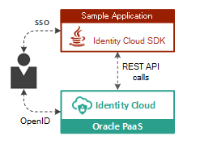
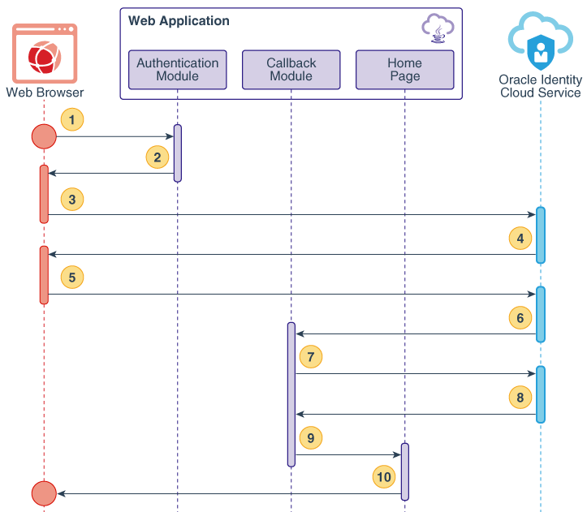
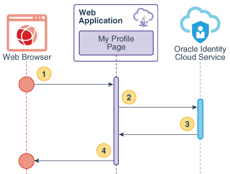

# Oracle Identity Cloud Service's Software Development Kit (SDK)

## Overview

Use software development kits (SDKs) when developing applications, allowing them to connect to Oracle Identity Cloud Service to authenticate and get an access token to identify registered users in Oracle Identity Cloud Service.

The SDK wraps some Oracle Identity Cloud Service calls that are made by the applications, simplifying the development.

The SDKs can be downloaded from the **Downloads** page of the Identity Cloud Service console, as zip files, for the following languages:
- **Java**: The file you download contains a *jar* library file.
- **JavaScript/Node.js**: The file you download contains a passport strategy library file (see http://passportjs.org/).
- **Python**: The file you download contains two python files: *IdcsClient.py* and *Constants.py*.

## Tutorials and Sample Applications

To understand how to use the SDKs, Oracle provides sample web applications for each of the supported languages listed above. Use these sample applications for learning purposes.

Learn how to configure SSO between Oracle Identity Cloud Service and the sample applications by using one of the following tutorials:

#### Comming soon ...

The sample applications implement two use cases: one for user authentication and the other for  accessing detailed information from the logged-in user.

#### Use Case #1: User Authentication

This graphical overview explains the flow of events, calls, and responses between the web browser, the web application, and Oracle Identity Cloud Service for authenticating users.

**Detailed flow:**
1. The user requests an authenticated resource.
2. The authentication module generates a request-authorization-code URL and redirects the user's browser.
3. The Oracle Identity Cloud Service **Sign In** page is presented.
4. The user submits their Oracle Identity Cloud Service login credentials.
5. Oracle Identity Cloud Service issues an authorization code.
6. The sample application calls Oracle Identity Cloud Service to exchange the authorization code for an access token.
7. Oracle Identity Cloud Service issues the access token.
8. A session is established, and the user is redirected to the **Home** page.
9. The **Home** page of the sample application is presented.

#### Use Case #2: Get User Details

The image illustrates the get user details flow between the user’s web browser, the sample application, and Oracle Identity Cloud Service when using the user authentication SDKs.

**Detailed flow:**
1. The user requests the **/myProfile** resource.
2. The sample application calls Oracle Identity Cloud Service using the SDK, which uses the access token stored in the user session as a parameter.
3. The user's details are sent to the sample application as a JSON object.
4. The **My Profile** page renders the JSON object as an HTML file.

## License

Copyright (c) 2018, Oracle and/or its affiliates. All rights reserved.

You may not use the identified files except in compliance with the Universal Permissive License (UPL), Version 1.0 (the "License.")

You may obtain a copy of the License at https://opensource.org/licenses/UPL. 

Unless required by applicable law or agreed to in writing, software distributed under the License is distributed on an "AS IS" BASIS, WITHOUT WARRANTIES OR CONDITIONS OF ANY KIND, either express or implied.

See the License for the specific language governing permissions and limitations under the License.
